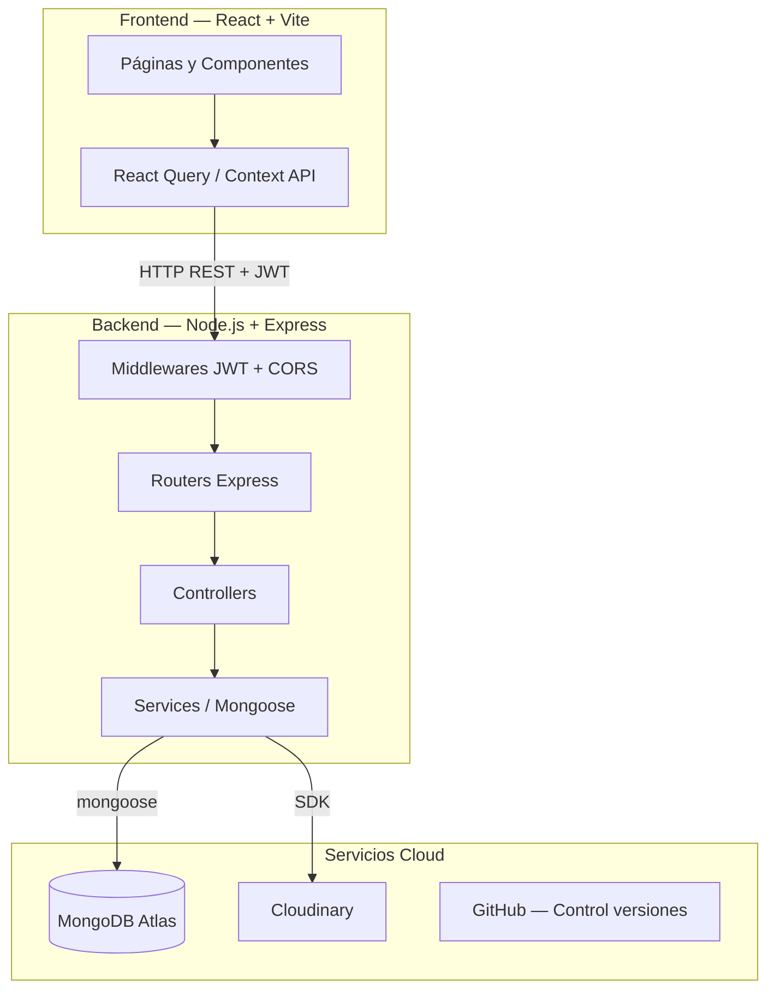
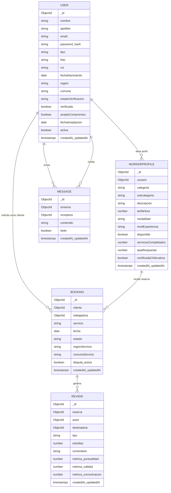
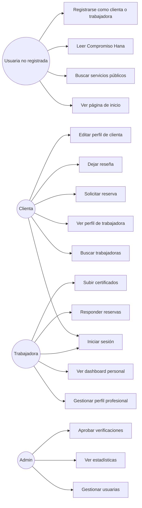
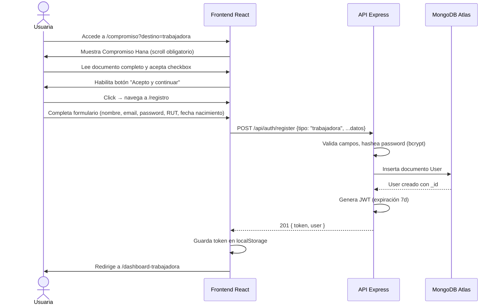
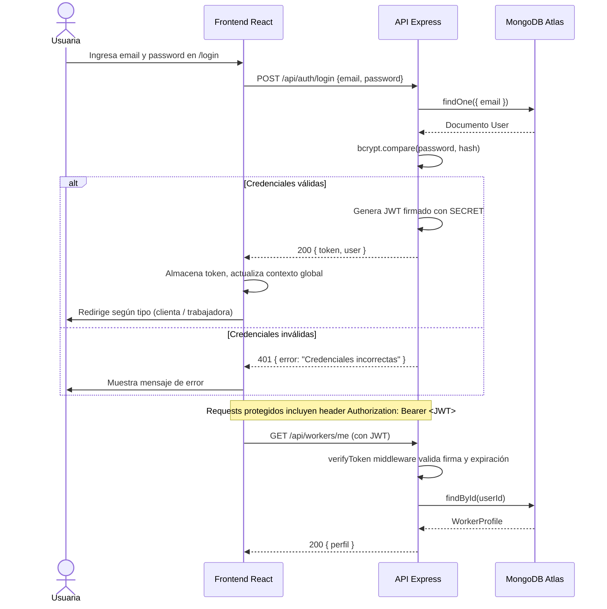

# INFORME ESTADO DE AVANCE 2
## Plataforma Hana — Hecho por mujeres, para mujeres

**Asignatura:** TPY1101 — Taller Aplicado de Programación  
**Integrantes:** Adolfo Medina · Solange Valdebenito  
**Fecha:** Mayo 2026

---

## Índice

1. Contexto del proyecto (EP1)
2. Descripción del problema u oportunidad (EP1)
3. Objetivos (EP1)
4. Situación inicial del cliente (EP1)
5. Planificación (EP1)
6. Tecnologías adecuadas (EP1)
7. Servicios cloud (EP1)
8. Conceptualización (EP1)
9. Metodología (EP1)
10. Documentación de avance (EP1)
11. **[NUEVO] Diagramas y documentos de diseño**
12. **[NUEVO] Configuración del ambiente de pruebas**
13. **[NUEVO] Backup de base de datos y configuración de servidor**
14. **[NUEVO] Desarrollo de la solución — estado de avance actual**

---

## Introducción

El presente documento corresponde al Estado de Avance 2 del proyecto Hana, plataforma web cloud orientada a conectar mujeres que ofrecen servicios profesionales con mujeres que requieren contratarlos. Este informe integra lo desarrollado en la Evaluación Parcial 1 y agrega la documentación técnica exigida para la segunda etapa: diagramas de arquitectura y datos, configuración del ambiente de pruebas, procedimientos de respaldo de base de datos y evidencia del avance de desarrollo del software.

---

## Secciones 1 a 10 — Desarrollo Evaluación Parcial 1

*(Se incluye el contenido completo del Informe Estado de Avance 1, adjunto o incorporado según instrucción del docente guía.)*

---

## 11. Diagramas y documentos de diseño

### 11.1 Arquitectura del sistema

Hana implementa una arquitectura de tres capas desacopladas, comunicadas mediante una API REST con autenticación JWT.

```
┌─────────────────────────────────────────────────────────────────┐
│                        CLIENTE (Browser)                        │
│                React 18 + Vite + TypeScript + Tailwind          │
│                      (Vercel — producción)                      │
└─────────────────────┬───────────────────────────────────────────┘
                      │ HTTPS / JSON
                      │ Authorization: Bearer <JWT>
┌─────────────────────▼───────────────────────────────────────────┐
│                     API REST — Backend                          │
│              Node.js 20 + Express 4 + Mongoose                  │
│                      (Render — producción)                      │
│                                                                 │
│  Rutas:  /api/auth  /api/workers  /api/bookings                │
│          /api/reviews  /api/messages  /api/admin               │
└─────────────────────┬───────────────────────────────────────────┘
                      │ mongoose + TLS
┌─────────────────────▼───────────────────────────────────────────┐
│                  MongoDB Atlas (PaaS cloud)                     │
│        Cluster gratuito M0 — región us-east-1                  │
│  Colecciones: users · workerprofiles · bookings                │
│               reviews · messages · portfolioitems              │
└─────────────────────────────────────────────────────────────────┘
                      │
┌─────────────────────▼───────────────────────────────────────────┐
│                  Cloudinary (SaaS cloud)                        │
│     Almacenamiento de imágenes de perfil y certificados        │
└─────────────────────────────────────────────────────────────────┘
```

**Patrón aplicado:** Arquitectura por capas (Layered Architecture) con separación estricta entre presentación, lógica de negocio y persistencia. El frontend nunca accede directamente a la base de datos.

---

### 11.2 Diagrama de Arquitectura (Mermaid)



---

### 11.3 Diagrama Entidad-Relación (Colecciones MongoDB)



---

### 11.4 Diagrama de Casos de Uso



---

### 11.5 Diagrama de Secuencia — Registro de trabajadora



---

### 11.6 Diagrama de Secuencia — Autenticación y acceso protegido



---

### 11.7 Patrones de diseño aplicados

| Patrón | Aplicación en Hana |
|--------|-------------------|
| **MVC (Model-View-Controller)** | Backend: Models (Mongoose), Routes/Controllers, respuestas JSON |
| **Repository / Service Layer** | Controllers delegan lógica a funciones de servicio separadas |
| **JWT Stateless Auth** | Autenticación sin sesiones en servidor; token firmado con SECRET |
| **Component Pattern** | Frontend: componentes reutilizables (Navbar, Footer, WorkerCard, etc.) |
| **Context + Custom Hooks** | Estado global de autenticación vía `AuthContext`; datos via `useWorkers`, `useAuth` |
| **REST API** | Endpoints semánticos: GET /workers, POST /auth/login, PATCH /workers/me |
| **Middleware Chain** | Express: CORS → JWT verify → rate limit → controller |

---

## 12. Configuración del ambiente de pruebas

### 12.1 Requisitos del sistema (entorno local)

| Componente | Versión mínima | Utilidad |
|------------|---------------|----------|
| Node.js | 20.x LTS | Runtime backend y frontend |
| npm | 10.x | Gestión de dependencias |
| Git | 2.x | Control de versiones |
| Navegador moderno | Chrome 120+ / Firefox 121+ | Pruebas del frontend |
| Conexión a internet | — | Acceso a MongoDB Atlas y Cloudinary |

---

### 12.2 Variables de entorno — Backend (`backend/.env`)

```env
# Base de datos
MONGODB_URI=mongodb+srv://<usuario>:<password>@cluster0.xxxxx.mongodb.net/hana?retryWrites=true&w=majority

# Autenticación
JWT_SECRET=clave_secreta_segura_minimo_32_caracteres

# Cloudinary (imágenes)
CLOUDINARY_CLOUD_NAME=nombre_cloud
CLOUDINARY_API_KEY=clave_api
CLOUDINARY_API_SECRET=secreto_api

# Servidor
PORT=5000
NODE_ENV=development
```

> **Importante:** El archivo `.env` nunca se sube al repositorio. Está incluido en `.gitignore`.

---

### 12.3 Variables de entorno — Frontend (`frontend/.env`)

```env
VITE_API_URL=http://localhost:5000/api
```

En producción se reemplaza por la URL de Render.

---

### 12.4 Instalación del ambiente de pruebas local

**Paso 1 — Clonar el repositorio**
```bash
git clone https://github.com/tornasol89/hana-26.git
cd hana-26
```

**Paso 2 — Instalar dependencias del backend**
```bash
cd backend
npm install
```

Dependencias principales instaladas:

| Paquete | Versión | Función |
|---------|---------|---------|
| express | 4.x | Framework HTTP |
| mongoose | 8.x | ODM para MongoDB |
| bcryptjs | 2.x | Hash de contraseñas |
| jsonwebtoken | 9.x | Generación y verificación JWT |
| cloudinary | 2.x | Gestión de imágenes |
| multer | 1.x | Upload de archivos |
| cors | 2.x | Política de origen cruzado |
| dotenv | 16.x | Variables de entorno |
| express-rate-limit | 7.x | Límite de peticiones |

**Paso 3 — Instalar dependencias del frontend**
```bash
cd ../frontend
npm install
```

Dependencias principales instaladas:

| Paquete | Versión | Función |
|---------|---------|---------|
| react | 18.x | Librería UI |
| vite | 6.x | Bundler + dev server |
| typescript | 5.x | Tipado estático |
| tailwindcss | 3.x | Estilos utilitarios |
| react-router-dom | 7.x | Enrutamiento SPA |
| @tanstack/react-query | 5.x | Cache y fetching de datos |
| motion | 12.x | Animaciones |
| shadcn/ui | — | Componentes accesibles |
| sonner | — | Notificaciones toast |
| lucide-react | — | Íconos |

**Paso 4 — Levantar el ambiente de pruebas**

Terminal 1 — Backend:
```bash
cd backend
npm run dev
# Servidor escucha en http://localhost:5000
```

Terminal 2 — Frontend:
```bash
cd frontend
npm run dev
# Aplicación disponible en http://localhost:5173
```

---

### 12.5 Plan de pruebas

#### Pruebas operativas (funcionalidad básica)

| ID | Módulo | Caso de prueba | Resultado esperado | Estado |
|----|--------|----------------|--------------------|--------|
| OP-01 | Autenticación | Registro con datos válidos | Usuario creado, JWT retornado | ✅ Aprobado |
| OP-02 | Autenticación | Login con credenciales correctas | Token JWT generado | ✅ Aprobado |
| OP-03 | Autenticación | Login con password incorrecto | Error 401 | ✅ Aprobado |
| OP-04 | Compromiso Hana | Scroll completo habilita aceptación | Checkbox se activa al llegar al final | ✅ Aprobado |
| OP-05 | Perfil trabajadora | Crear perfil con campos requeridos | Perfil guardado en BD | ✅ Aprobado |
| OP-06 | Búsqueda | Filtrar por categoría | Lista filtrada correctamente | ✅ Aprobado |
| OP-07 | Búsqueda | Filtrar por región | Solo muestra trabajadoras de la región | ✅ Aprobado |
| OP-08 | Perfil público | Ver perfil de trabajadora | Información visible sin autenticación | ✅ Aprobado |
| OP-09 | Dashboard | Acceder a /dashboard-trabajadora sin token | Redirige a /login | ✅ Aprobado |
| OP-10 | Imágenes | Subir foto de perfil | Imagen almacenada en Cloudinary | ✅ Aprobado |

#### Pruebas de validación

| ID | Módulo | Caso de prueba | Resultado esperado | Estado |
|----|--------|----------------|--------------------|--------|
| VA-01 | Registro | Email duplicado | Error 400 "Email ya registrado" | ✅ Aprobado |
| VA-02 | Registro | RUT inválido | Error de validación del modelo | ✅ Aprobado |
| VA-03 | Registro | Menor de 18 años | Error "Edad mínima 18 años" | ✅ Aprobado |
| VA-04 | Registro | Campos requeridos vacíos | Error de validación Mongoose | ✅ Aprobado |
| VA-05 | JWT | Token expirado | Error 401 Unauthorized | ✅ Aprobado |
| VA-06 | JWT | Token manipulado | Error 401 Invalid signature | ✅ Aprobado |

#### Pruebas de verificación (entorno)

| ID | Verificación | Resultado |
|----|-------------|-----------|
| VE-01 | Backend responde en puerto 5000 | ✅ Confirmado |
| VE-02 | Frontend accede a API local (CORS configurado) | ✅ Confirmado |
| VE-03 | Conexión a MongoDB Atlas establecida | ✅ Confirmado |
| VE-04 | Variables de entorno cargadas correctamente | ✅ Confirmado |
| VE-05 | Imágenes se almacenan en Cloudinary | ✅ Confirmado |
| VE-06 | Hot Reload de Vite funcional en desarrollo | ✅ Confirmado |

---

## 13. Backup de base de datos y configuración de servidor

### 13.1 Estrategia de respaldo — MongoDB Atlas

MongoDB Atlas proporciona respaldos automáticos en el tier gratuito (M0). Adicionalmente, se realizan respaldos manuales con `mongodump` para el entorno de pruebas.

**Procedimiento de backup manual:**

```bash
# Paso 1: Instalar MongoDB Database Tools (si no están instalados)
# Windows: descargar desde https://www.mongodb.com/try/download/database-tools

# Paso 2: Exportar la base de datos completa
mongodump \
  --uri="mongodb+srv://<usuario>:<password>@cluster0.xxxxx.mongodb.net/hana" \
  --out="./backups/hana_backup_$(date +%Y%m%d_%H%M%S)"

# Resultado: carpeta con archivos BSON por colección
# backups/
# └── hana_backup_20260515_143000/
#     └── hana/
#         ├── users.bson
#         ├── users.metadata.json
#         ├── workerprofiles.bson
#         └── ...
```

**Procedimiento de restauración:**

```bash
mongorestore \
  --uri="mongodb+srv://<usuario>:<password>@cluster0.xxxxx.mongodb.net/hana" \
  --dir="./backups/hana_backup_20260515_143000/hana" \
  --drop
```

**Exportación en formato JSON (legible):**

```bash
# Exportar colección específica en JSON
mongoexport \
  --uri="mongodb+srv://<usuario>:<password>@cluster0.xxxxx.mongodb.net/hana" \
  --collection=users \
  --out="backup_users.json" \
  --pretty
```

---

### 13.2 Configuración del servidor de producción — Backend (Render)

**Plataforma:** Render.com (PaaS) — Plan gratuito

**Pasos de configuración:**

1. Crear cuenta en render.com y conectar repositorio GitHub
2. Crear nuevo servicio "Web Service"
3. Configurar:
   - **Build Command:** `cd backend && npm install`
   - **Start Command:** `cd backend && npm start`
   - **Root Directory:** `/` (raíz del repo)
4. Agregar variables de entorno en el panel de Render (mismas que `.env` local):
   - `MONGODB_URI`
   - `JWT_SECRET`
   - `CLOUDINARY_CLOUD_NAME`
   - `CLOUDINARY_API_KEY`
   - `CLOUDINARY_API_SECRET`
   - `NODE_ENV=production`
5. Deploy automático al hacer push a `feat/nuevo-frontend`

**`package.json` del backend — scripts relevantes:**
```json
{
  "scripts": {
    "start": "node src/index.js",
    "dev": "nodemon src/index.js"
  }
}
```

---

### 13.3 Configuración del servidor de producción — Frontend (Vercel)

**Plataforma:** Vercel.com (PaaS) — Plan gratuito

**Pasos de configuración:**

1. Crear cuenta en vercel.com y conectar repositorio GitHub
2. Importar proyecto → seleccionar carpeta `frontend/`
3. Configurar:
   - **Framework Preset:** Vite
   - **Build Command:** `npm run build`
   - **Output Directory:** `dist`
   - **Root Directory:** `hana-26/frontend`
4. Agregar variable de entorno:
   - `VITE_API_URL=https://hana-backend.onrender.com/api`
5. Deploy automático en cada push

**`vite.config.ts` — configuración relevante:**
```typescript
export default defineConfig({
  plugins: [react()],
  resolve: {
    alias: { "@": path.resolve(__dirname, "./src") }
  }
})
```

---

### 13.4 Instalación de herramientas en servidor de producción

Render instala automáticamente Node.js 20.x. Las dependencias se instalan con `npm install` en cada deploy. No se requiere configuración manual adicional del sistema operativo.

Para el entorno local de desarrollo se requiere:

```bash
# Verificar versiones instaladas
node --version    # >= 20.0.0
npm --version     # >= 10.0.0
git --version     # >= 2.40.0

# Instalar nodemon globalmente (solo desarrollo)
npm install -g nodemon
```

---

### 13.5 Comparación de plataformas de despliegue evaluadas

| Criterio | Render | Railway | Vercel (backend) |
|----------|--------|---------|------------------|
| Plan gratuito | ✅ | ✅ (limitado) | ❌ backend no soporta |
| Node.js soporte | ✅ | ✅ | ✅ |
| Variables de entorno | ✅ | ✅ | ✅ |
| Deploy desde GitHub | ✅ | ✅ | ✅ |
| Sleep en inactividad (free) | ✅ (50s) | ❌ | — |
| Logs en tiempo real | ✅ | ✅ | ✅ |
| **Decisión** | **Backend** | Evaluando | **Frontend** |

> El backend se desplegará en Render y el frontend en Vercel, ambas plataformas PaaS en la nube con plan gratuito suficiente para el MVP académico.

---

## 14. Desarrollo de la solución — Estado de avance actual

### 14.1 Funcionalidades implementadas (cerradas)

| Módulo | Funcionalidad | Tecnología aplicada |
|--------|--------------|-------------------|
| Autenticación | Registro con validación de RUT, edad y email único | bcrypt + JWT + Mongoose validators |
| Autenticación | Login con JWT de 7 días | jsonwebtoken |
| Autenticación | Rutas protegidas por rol | Middleware JWT + tipo de usuario |
| Compromiso Hana | Lectura obligatoria con barra de progreso | React state + scroll event |
| Perfil trabajadora | Creación y edición de perfil profesional | Mongoose + Cloudinary |
| Perfil trabajadora | Upload de foto de perfil | multer + Cloudinary SDK |
| Perfil trabajadora | Upload de certificados | multer + Cloudinary SDK |
| Búsqueda | Filtro por categoría, subcategoría y región | Query params → Mongoose filter |
| Búsqueda | Ordenamiento por evaluación y tarifa | Array sort en frontend |
| Búsqueda | Carrusel 3D de mejores evaluadas | Three.js style + Framer Motion |
| Perfil público | Vista pública de trabajadora con reseñas | GET /api/workers/:id |
| Dashboard trabajadora | Vista personalizada con métricas | React + TanStack Query |
| Reviews | Sistema de reseñas con métricas | Mongoose Review model |
| UI/UX | Diseño responsive con tema oscuro/claro | Tailwind CSS + shadcn/ui |

### 14.2 Funcionalidades en desarrollo o planificadas

| Módulo | Estado | Prioridad |
|--------|--------|-----------|
| Gestión de reservas completa | En desarrollo | Alta |
| Mensajería entre usuarias | Modelo creado, UI pendiente | Media |
| Panel de administración | Rutas creadas, UI pendiente | Media |
| Validación documental (carnet) | Modelo listo, flujo pendiente | Alta |
| Despliegue en producción (Vercel + Render) | Planificado | Alta |
| Georreferenciación | Planificado | Baja |
| Pasarela de pago | Fuera del alcance MVP | — |

### 14.3 Estado de avance — Gráfico

```
Funcionalidades completadas:
████████████████████░░░░  78%  (14 de 18 módulos núcleo)

Autenticación y seguridad:
█████████████████████████ 100% ✅

Gestión de perfiles:
█████████████████████░░░░  85% ✅

Búsqueda y visualización:
█████████████████████████ 100% ✅

Reservas y mensajería:
████████░░░░░░░░░░░░░░░░░  35% 🔄

Despliegue productivo:
████░░░░░░░░░░░░░░░░░░░░░  20% 🔄

Panel administración:
████████░░░░░░░░░░░░░░░░░  30% 🔄
```

### 14.4 Arquitectura de carpetas del proyecto

```
hana-26/
├── backend/
│   ├── src/
│   │   ├── controllers/     # Lógica de negocio
│   │   ├── models/          # Esquemas Mongoose (User, WorkerProfile, Booking, Review...)
│   │   ├── routes/          # Endpoints REST
│   │   ├── middlewares/     # JWT auth, rate limit, upload
│   │   ├── utils/           # Validadores, normalizadores
│   │   └── index.js         # Entrada del servidor
│   ├── .env                 # Variables de entorno (no en repo)
│   └── package.json
│
└── frontend/
    ├── src/
    │   ├── components/      # Componentes reutilizables (UI, Navbar, Footer...)
    │   ├── pages/           # Vistas por ruta (Home, BuscarServicios, Compromiso...)
    │   ├── features/        # Módulos por dominio (auth, workers)
    │   ├── config/          # Constantes y contenido estático
    │   └── assets/          # Imágenes locales
    ├── .env                 # Variable VITE_API_URL
    └── package.json
```

### 14.5 Buenas prácticas aplicadas

- **Seguridad:** Passwords hasheadas con bcrypt (salt rounds: 10). JWT firmado con SECRET de al menos 32 caracteres. Variables sensibles en `.env` excluido del repositorio con `.gitignore`.
- **Validación:** Validación en modelo Mongoose (tipo, RUT, edad mínima 18 años, email único) y en frontend antes de enviar al servidor.
- **Control de versiones:** Git con ramas separadas para features (`feat/nuevo-frontend`). Commits descriptivos en cada funcionalidad.
- **Código limpio:** TypeScript en frontend para tipado estático. Separación de responsabilidades (controllers, services, models). Componentes pequeños y reutilizables.
- **CORS:** Configurado para aceptar solo orígenes autorizados en producción.
- **Rate limiting:** Middleware `express-rate-limit` para proteger endpoints de autenticación.

---

## Conclusiones

El proyecto Hana ha alcanzado un estado de avance funcional sólido para su etapa de MVP académico. Se ha implementado correctamente el núcleo de la plataforma: autenticación segura con JWT, sistema de perfiles profesionales, búsqueda con filtros, visualización pública y el flujo del Compromiso Hana como mecanismo de confianza diferenciador.

La arquitectura elegida (React + Node.js + MongoDB Atlas) ha demostrado ser adecuada para el alcance del proyecto, permitiendo iteraciones rápidas y una separación clara entre capas. La documentación generada en este informe —diagramas, plan de pruebas, procedimientos de backup y configuración de servidor— establece los lineamientos técnicos necesarios para avanzar hacia el despliegue productivo en Vercel y Render.

## Lecciones aprendidas

- La definición temprana del modelo de datos evitó refactorizaciones costosas durante el desarrollo.
- El uso de variables de entorno desde el inicio simplificó la transición entre ambiente local y producción.
- La metodología ágil con iteraciones cortas permitió detectar y corregir problemas de usabilidad (como el orden de filtros y el diseño de tarjetas) antes de que se acumularan.
- El control de versiones con Git como evidencia de avance resultó fundamental tanto para la trazabilidad técnica como para la documentación académica del progreso.

---

*Hana — Hecho por mujeres, para mujeres · Adolfo Medina · Solange Valdebenito · DuocUC · 2026*
